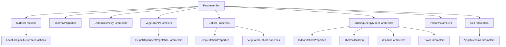

# [Model Components](@id model_components)

The model is structured using model components as composite types. Here is a general overview of the model components:

```mermaid
graph TD
  A[ParameterSet] --> B[SurfaceFractions] --> F[LocationSpecificSurfaceFractions]
  A --> C[ThermalProperties]
  A --> D[UrbanGeometryParameters]
  A --> E[VegetationParameters] --> G[HeightDependentVegetationParameters]
  A --> H[Optical Properties] --> I[SimpleOpticalProperties]
  H --> J[VegetatedOpticalProperties]
  A --> K[BuildingEnergyModelParameters]
  K --> L[IndoorOpticalProperties]
  K --> M[ThermalBuilding]
  K --> N[WindowParameters]
  K --> O[HVACParameters]
  A --> P[PersonParameters]
  A --> Q[SoilParameters]
  Q --> R[VegetatedSoilParameters]
```
